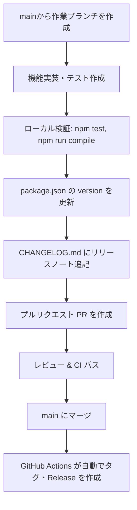

# ブランチ戦略とリリースマネジメント

本ドキュメントでは、StructGridEditor におけるブランチ戦略、セマンティックバージョニング、およびリリース・タグ運用のルールを定めます。

---

## 1. 概要

本リポジトリでは **GitHub Flow** を採用しています。
`main` ブランチは常に最新かつリリース可能な状態を維持し、すべての開発作業は `main` からブランチを切って進めます。

```
[main] ─────────────────────●──────────────●──────────>
          \                / (PRマージ)   / (PRマージ)
           └── [feature/...] ──┘         /
             \                          /
              └── [fix/...] ───────────┘
```

- **1 PR = 1 リリース**: `main` ブランチへのプルリクエスト（PR）マージをトリガーとして、自動的にリリース・タグ作成が行われます。
- **PR作成時にバージョン確定**: PRの変更差分に `package.json` のバージョン更新と `CHANGELOG.md` の追記を必ず含めます。

---

## 2. ブランチ戦略

すべての作業ブランチは必ず `main` の最新コミットから作成します。

### ブランチ命名規則

| プレフィックス | 用途 | 例 |
| :--- | :--- | :--- |
| `feature/` | 新機能の追加、既存機能の拡張 | `feature/virtual-scroll`, `feature/undo-redo` |
| `fix/` | 通常のバグ修正 | `fix/tsv-parser-newlines`, `fix/cursor-offset` |
| `hotfix/` | 本番リリース後の緊急バグ修正 | `hotfix/critical-load-error` |
| `refactor/` | 振る舞いを変えないコード整理 | `refactor/webview-hooks` |
| `docs/` | ドキュメントの追加・更新 | `docs/add-release-flow` |
| `chore/` | ビルド設定、依存パッケージ更新、CI修正 | `chore/update-dependencies` |

---

## 3. セマンティックバージョニング (SemVer)

バージョン表記は `MAJOR.MINOR.PATCH`（例: `1.2.3`）に従います。

- **MAJOR (メジャー: `X.0.0`)**: 破壊的変更（互換性のない仕様変更、設定フォーマットの大幅刷新など）
- **MINOR (マイナー: `0.X.0` / `1.X.0`)**: 後方互換性のある新機能追加・機能拡張
- **PATCH (パッチ: `0.0.X` / `1.0.X`)**: 後方互換性のあるバグ修正・軽微な改善

> [!NOTE]
> 現在のバージョンが `0.x.x`（初期開発フェーズ）の間は、APIや挙動が急激に変化することがあります。正式リリース（`1.0.0`）以降は上記のSemVerルールを厳格に適用します。

---

## 4. 開発・リリースのライフサイクル

開発からリリース完了までの具体的な手順は以下の通りです。



### ステップ 1: 作業ブランチの作成と実装
```bash
git checkout main
git pull origin main
git checkout -b feature/column-sort
# 実装作業・テストの追加
```

### ステップ 2: ローカル品質検証
コミット前に静的解析・テストがすべて通過することを確認します。
```bash
npm run test:unit
npm run check-types
npm run lint
```

### ステップ 3: package.json と CHANGELOG.md の更新
PR作成前に、今回の変更に応じたバージョンを決定して更新します。

1. **`package.json`**: `"version"` をインクリメント
   ```json
   "version": "0.1.0",
   ```

2. **`CHANGELOG.md`**: 最上部に新しいバージョンの見出しと日付、変更内容を追記
   ```markdown
   # Change Log

   ## 0.1.0 - 2026-09-27

   - 列ヘッダークリックによるソート機能を追加
   - TSVパース時の改行文字の扱いを修正
   ```

### ステップ 4: PR 作成とマージ
`package.json` と `CHANGELOG.md` を含めてコミットし、`main` に向けて PR を作成します。
PR のレビューおよび CI テスト通過後、`main` ブランチへマージします。

---

## 5. 自動タグ付け & GitHub Release (CI)

`main` ブランチへのプッシュ・マージを検知して、ワークフロー [`.github/workflows/release-tag.yml`](../.github/workflows/release-tag.yml) が自動起動します。

1. `package.json` の `"version"`（例: `0.1.0`）を取得
2. Git タグ `0.1.0`（※プレフィックスなし）が存在しない場合、自動でタグを作成してプッシュ
3. `CHANGELOG.md` から該当バージョンの変更履歴を抽出し、GitHub Release を自動発行

> [!TIP]
> ドキュメント修正のみのPRなど、バージョンを上げずにマージした場合は、既存タグと一致するため自動リリース処理はスキップされます。

---

## 6. 手動でのタグ発行（例外時・リカバリ用）

CI環境のトラブル等で手動でタグを作成・発行する必要がある場合は、以下のコマンドを実行します。

```bash
# main の最新を取得
git checkout main
git pull origin main

# タグの作成とプッシュ（例: 0.1.0）
git tag 0.1.0
git push origin 0.1.0

# GitHub CLI による Release 発行（任意）
gh release create 0.1.0 --title "0.1.0" --notes "リリースノート内容"
```
